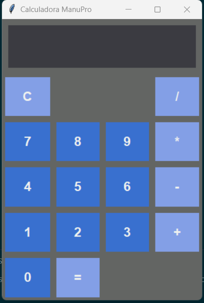

##Calculadora con Interfaz Gráfica en Python (Tkinter)

Aplicación de calculadora con interfaz gráfica desarrollada en Python utilizando Tkinter. 
Este proyecto fue creado como parte de mi aprendizaje en desarrollo de software y manejo de interfaces gráficas.

---

##Características

* Interfaz gráfica moderna (modo oscuro)
* Operaciones básicas (+, -, *, /)
* Botón de limpiar (C)
* Diseño responsivo
* Manejo de errores

---

##Tecnologías

* Python
* Tkinter

---

##Cómo ejecutar

```bash
python calculadora.py
```

---

##Vista previa



---

##Habilidades demostradas

- Programación en Python
- Desarrollo de interfaces gráficas (Tkinter)
- Manejo de eventos
- Uso de Git y GitHub
- Estructuración de proyectos

##Autor

Manuel Peña
